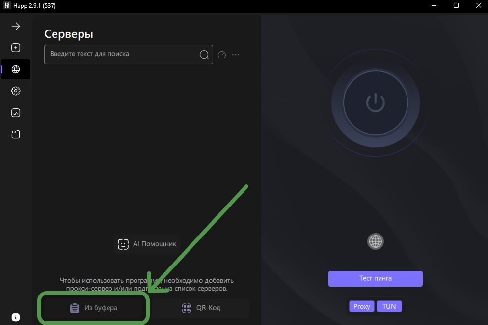
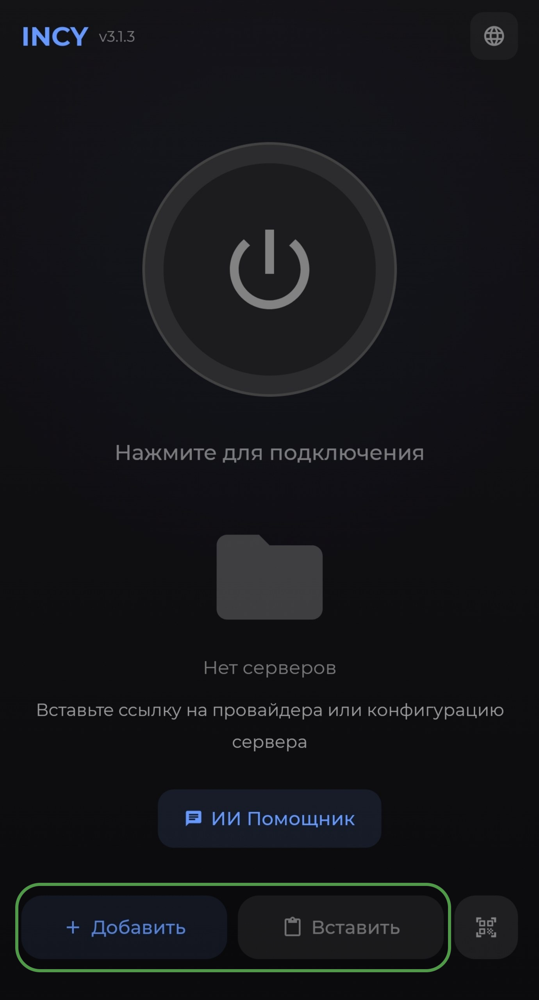

# 📲 Инструкция по подключению VPN

Выберите вашу операционную систему и откройте нужную инструкцию.

После оплаты вы получите **личную ссылку подписки**.
Её нужно скопировать и добавить в приложение.

---

🖥 Windows - HAPP

## 🖥 Подключение на Windows

**Основное приложение:** HAPP

### 1. Установка приложения

1. Скачайте приложение [**INCY**](https://github.com/INCY-DEV/incy-platforms/releases/download/desktop-v3.2.0/incy-windows-setup.exe) для Windows.
2. Установите приложение на компьютер.
3. Запустите приложение.

### 2. Добавление подписки

1. Скопируйте вашу личную ссылку подписки.
2. Откройте приложение **HAPP**.

4. Нажмите **Из буфера**.
5. Вставьте вашу ссылку подписки.

### 3. Подключение

1. Выберите нужный сервер.
2. Нажмите кнопку подключения.
3. Дождитесь статуса **Connected** / **Подключено**.

✅ Готово - VPN подключен на Windows.

---

🤖 Android - ICNY

## 🤖 Подключение на Android

**Основное приложение:** ICNY

### 1. Установка приложения

1. Скачайте приложение **ICNY** на Android. [GooglePlay](https://play.google.com/store/apps/details?id=llc.itdev.incy&pcampaignid=web_share)
2. Установите приложение.
3. Откройте приложение.

### 2. Добавление подписки

1. Скопируйте вашу личную ссылку подписки из телеграмм бота.

3. В приложении нажмите **Add** / **Import** / **Добавить** или нажмите кнопку "Вставить".
4. Выберите добавление через ссылку.
5. Вставьте вашу ссылку подписки.
6. Нажмите **Save** / **Сохранить**.

### 3. Подключение

1. Выберите нужный сервер.
2. Нажмите кнопку подключения.
3. Дождитесь статуса подключения.

✅ Готово - VPN подключен на Android.

---

🍎 iOS

## 🍎 Подключение на iOS

### 1. Установка приложения

1. Скачайте приложение для iOS из [**App Store**](https://apps.apple.com/ru/app/incy/id6756943388).
2. Установите приложение.
3. Откройте приложение.

### 2. Добавление подписки

1. Скопируйте вашу личную ссылку подписки.

3. Нажмите **Add** / **Import** / **Добавить профиль**.
4. Выберите добавление через ссылку.
5. Вставьте вашу ссылку подписки.
6. Нажмите **Save** / **Сохранить**.

### 3. Подключение

1. Выберите нужный сервер.
2. Нажмите кнопку подключения.
3. Дождитесь статуса подключения.

✅ Готово - VPN подключен на iOS.

---

📺 Android TV

## 📺 Подключение на Android TV

### 1. Установка приложения

1. Скачайте приложение [GooglePlay](https://play.google.com/store/apps/details?id=llc.itdev.incy&pcampaignid=web_share).
3. Установите приложение.
4. Откройте его на телевизоре.

### 2. Добавление подписки

1. Скопируйте или введите вашу личную ссылку подписки.
2. Нажмите **Add** / **Import** / **Добавить профиль**.
3. Выберите добавление через ссылку.
4. Вставьте ссылку подписки.
5. Сохраните профиль.

### 3. Подключение

1. Выберите нужный сервер.
2. Нажмите кнопку подключения.
3. Дождитесь статуса подключения.

✅ Готово - VPN подключен на Android TV.

---

❗ Что делать, если VPN не подключается?

## ❗ Возможные причины

Проверьте:

* правильно ли вставлена ссылка подписки;
* не закончилась ли подписка;
* выбран ли рабочий сервер;
* есть ли интернет без VPN;
* не включён ли другой VPN одновременно;
* обновлено ли приложение до последней версии.

## Что попробовать

1. Перезапустите приложение.
2. Выберите другой сервер.
3. Отключите другие VPN-приложения.
4. Проверьте интернет без VPN.
5. Удалите профиль и добавьте ссылку подписки заново.

Если проблема осталась - напишите в поддержку.

---

## 💬 Поддержка

Если у вас возникли сложности с подключением, напишите в [поддержку](https://t.me/r4ike).
Мы поможем настроить VPN на вашем устройстве.
